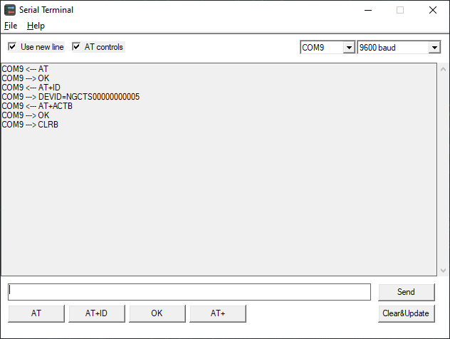

## Serial Terminal GUI version

May 1 2022 - v2.0.0

This is a second, graphical version of my serial monitor/terminal utility. It is similar to Arduino IDEs Serial Monitor.

Features:

- Send and receive ASCI strings
- Up to 64 plug and play serial ports
- AT command panel
- Save log to file

Well, if you know what COM port is, you should know what this app is for.

Built with [TDM-GCC](https://jmeubank.github.io/tdm-gcc/) 10

[👉 Download app (.exe file)](build-win32/serialterminal-2.0.0.zip)

