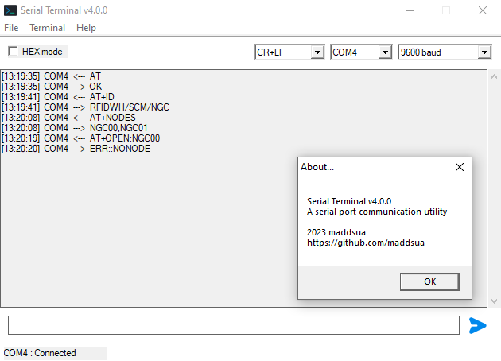

# maddsua/serial

This repo contains a few iterations of a serial terminal app made by myself as long as a library for easy COM port communications.

About v4: I'm not creating a release until I'm sure it does not contain any critical issues.

# Terminals

## Building process

Is as simple as runnig `make`. It requires:

- GCC 9+ (maybe lower, idk, get it from [MSYS2](https://packages.msys2.org/base/mingw-w64-gcc))
- Windows specific stuff (should come along with GCC build)
- windres (check if you have it included in binutils, should come along with GCC too)
- make tool. It is included in binutils, but is named like `make-some-build-info-nobody-cares-about.exe`. Just rename it to `make.exe`

## GUI Terminal

Features in V4:

- Port list auto update
- Support for input/output in HEX format
- Escaped special characters support
- User settings are now being saved
- Different line endings (CRLF/CR/LF/None)
- Timestamps
- Command echoing now can be disabled

 \
\
 

## CLI Terminal

Looks like this:

---

---

Pretty simple tool, has a help command, so as long as you are familiar with diskpart - you won't get lost.

 

### Build dependencies

- Windows 7+
- WinAPI headers and compiler support
- [JSON for Modern C++](https://github.com/nlohmann/json)

### Run dependencies

- Windows 7+
- [Universal C Runtime (URCT)](https://support.microsoft.com/en-us/topic/update-for-universal-c-runtime-in-windows-c0514201-7fe6-95a3-b0a5-287930f3560c)

 

# Lib serial-api

Allows you to do really cool stuff with com port. Is a part of v4 Serial Terminal. Actually this lib is the reason to create v4

## Building:

1. Enter `cd lib`
2. Run `make libshared` to get a dll
3. Run `make libstatic` to get a static .a library
4. Link to your project
5. ???
6. PROFIT!
