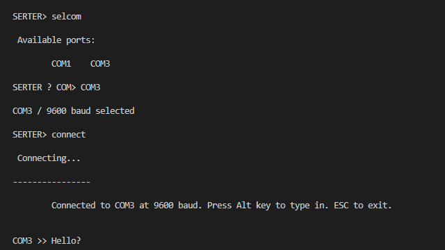
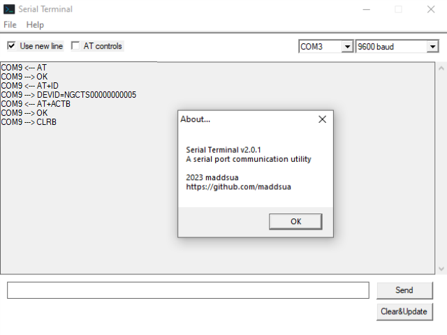

# Serial

This repo contains a few inerations of serial terminal app made by my as long as a library for easy COM port communications.

## Building process

Is as simple as runnig `make`. It requires:

- GCC 9+ (maybe lower, idk, get it from [MSYS2](https://packages.msys2.org/base/mingw-w64-gcc))
- Windows specific stuff (should come along with GCC build)
- windres (check if you have it included in binutils, should come along with GCC too)
- make tool. It is included in binutils, but is named like `make-some-build-info-nobody-cares-about.exe`. Just rename it to `make.exe`

# CLI Terminal

Look like this:

---

---

Pretty simple tool, has a help command, so as long as you are familiar with diskpart - you won't get lost.

# GUI Terminal

Now we're getting serious. It's the second generation of this tool. Stupidly simple to use:

### Note

- At the moment, special characters are not supported. Will come in v4

- You might ask what exaclty will be placed when the "Use newline" is active? It'll be just a single LF (0x0A) character

# Lib serial-api

Allows you to do really cool stuff with com port. Will be a part of v4 Serial Terminal. That thing is gonna be thicc.

Compile with a `make` command while in `lib` directory, then just link to your project. Super straightforward as always.