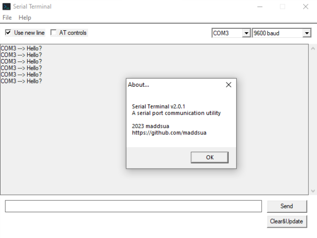

# Serial

This repo contains a few inerations of serial terminal app made by my as long as a library for easy COM port communications.

## CLI Terminal

Look like this:

---

---

Pretty simple tool, has a help command so as long as you are used to windows tools like diskpart - you won't get lost.

## GUI Terminal

Now we're getting serious. It's the second generation of this tool. Stupidly simple to use:

### Note

- At the moment, special characters are not supported. Will come in v4

- You might ask what newline it places when the "Use newline" is active? It'll be just '\n' character (LF, 0x0A)

## Lib serial-api